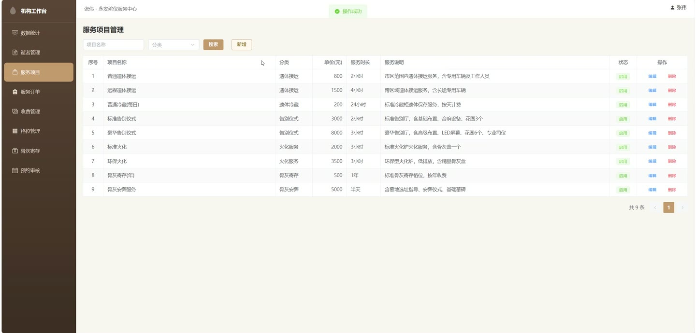
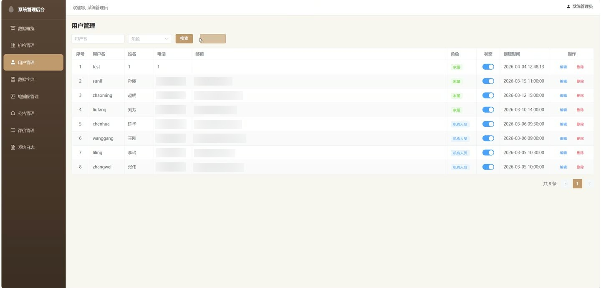
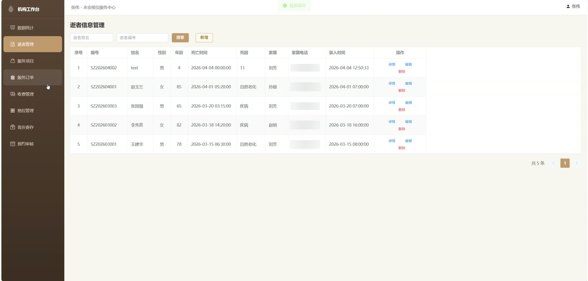
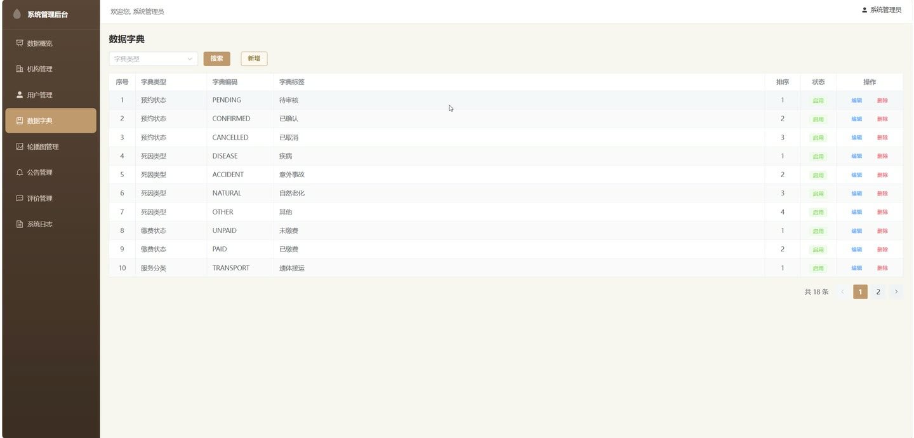

# (附文档)Springboot3+Vue3+MySQL 殡葬管理信息系统

**技术栈**：Springboot3、Vue3、MySQL

### 系统简介

殡葬管理信息系统是一套基于 SpringBoot3 + Vue3 前后端分离架构的殡葬行业综合管理平台。系统包含管理员、殡葬机构运营人员、逝者家属三类角色，覆盖逝者信息管理、服务订单流转、骨灰寄存、收费管理、预约审核、评价反馈、公告轮播等核心业务环节，提供从接运到寄存的全流程数字化管理。
 
### 核心功能
 
### 管理员端

 
- 查看系统总览仪表盘，统计用户数、机构数、逝者数、订单总数及待办理/办理中/已完成订单数量 
- 管理殡葬服务机构，支持新增、编辑、删除机构，配置机构名称、地址、联系电话、服务范围、收费规则、提醒天数、费用上限 
- 管理系统用户，支持新增、编辑、删除工作人员和家属账号，设置角色（管理员/机构/家属）、关联机构、启用/禁用账号 
- 搜索家属用户，通过关键词（姓名/手机号/用户名）快速检索，用于下拉选择关联 
- 管理数据字典，按字典类型（如服务类型、状态等）维护字典标签、编码、排序、启用状态 
- 查看系统操作日志，按用户名和操作类型筛选，记录操作内容、请求方法、参数、IP、耗时 
- 管理轮播图，支持新增、编辑、删除轮播图片，设置标题、图片链接、排序、启用状态 
- 管理公告通知，支持发布、编辑、删除公告，设置标题、内容、发布人、关联机构 
- 管理服务项目，支持新增、编辑、删除服务项目，设置项目名称、分类、价格、时长、描述、启用状态 
- 管理逝者信息，支持新增、编辑、删除逝者记录，系统自动生成逝者编号（SZ+年月+序号） 
- 查看并删除用户评价反馈 
- 管理骨灰寄存格位，支持新增、编辑、删除格位，设置区域、层数、格位编号、状态（可用/已占用）
 
### 机构端

 
- 查看机构专属仪表盘，统计本机构逝者数、订单数、待办理/办理中/已完成订单、未缴费/已缴费记录、正常寄存数量、待审核预约 
- 管理逝者信息，支持新增、编辑、删除逝者记录，填写姓名、性别、年龄、身份证号、死亡时间、死亡原因、家属信息 
- 创建服务订单，选择逝者、关联服务项目（支持多项目）、自动计算总金额，生成订单编号 
- 查看订单列表，支持按订单号、逝者姓名、状态、机构筛选，查看订单详情（含服务项目明细） 
- 更新订单状态，支持将订单状态变更为待办理、办理中、已完成 
- 管理收费记录，查看缴费列表，支持按订单号、逝者姓名、缴费状态筛选，确认缴费操作 
- 管理骨灰寄存，新增寄存记录（选择逝者、选择可用格位，自动占用格位），办理骨灰领取（释放格位） 
- 审核服务预约，查看预约列表（按家属姓名、状态筛选），审核通过或驳回并填写审核备注 
- 回复用户评价，查看本机构评价列表，填写回复内容，将评价状态变更为已回复 
- 管理本机构服务项目，新增、编辑、删除服务项目，设置价格、分类、时长、上下架状态 
- 管理本机构公告，发布、编辑、删除公告通知 
- 管理本机构骨灰寄存格位，新增、编辑、删除格位，查看格位占用状态
 
### 普通用户端（家属端）

 
- 用户注册，填写用户名、密码、姓名、手机号等信息完成账号注册 
- 用户登录，使用用户名和密码登录系统 
- 修改个人密码，输入原密码和新密码完成密码修改 
- 更新个人资料，修改姓名、手机号、邮箱、头像等个人信息 
- 提交服务预约，选择殡葬机构、服务类型、预约时间，填写家属姓名、联系电话、备注，提交后状态为待审核 
- 查看我的预约列表，查看自己提交的所有预约记录及审核状态 
- 取消预约，对未审核的预约执行取消操作 
- 查看我的缴费记录，查看关联逝者的所有缴费记录及缴费状态 
- 在线支付缴费，对未缴费的收费记录执行模拟支付操作 
- 查看可评价的已完成订单，获取本人关联逝者的已完成且未评价的服务订单列表 
- 提交服务评价，对已完成的服务订单进行评分、填写评价内容 
- 查看我的评价列表，查看自己提交的所有评价及机构回复 
- 公开查询逝者信息，通过逝者编号或身份证号查询逝者详情、关联服务订单、骨灰寄存状态 
- 浏览首页，查看轮播图、最新公告、机构列表 
- 查看机构详情，查看机构基本信息及该机构提供的服务项目 
- 浏览公告列表和公告详情 
- 查看公开评价列表，按机构筛选查看用户评价
 
### 技术栈

  后端框架 Spring Boot 3.x   ORM MyBatis-Plus   权限认证 JWT（JSON Web Token）   密码加密 BCryptPasswordEncoder   前端框架 Vue 3   状态管理 Pinia   前端路由 Vue Router   构建工具 Vite   数据库 MySQL   项目构建 Maven   数据可视化 ECharts（仪表盘统计） 
 
### 交付内容

 
- 后端完整源码 
- 前端完整源码 
- 数据库初始化脚本 
- 万字文档

## 界面展示

---

## 获取完整源码 + 万字文档

本仓库为项目介绍页。**完整前后端源码、数据库初始化脚本、万字项目文档**，请加微信 `kangkangcode`，或访问 [codekk.top](http://codekk.top) 获取。

可作课程设计 / 毕业设计参考，支持远程部署调试。